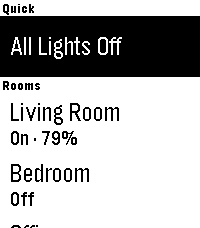
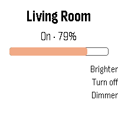
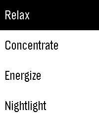

# Huemote

Control your Philips Hue lights from the **Pebble Time 2**. Toggle rooms, ramp
brightness, and apply scenes — talking straight to the **local** Hue Bridge over
your WiFi (no cloud round-trip), via the paired phone.

<p align="center">
  
  
  
</p>

## Screens

| Screen | Shows / does                                                                 |
| ------ | --------------------------------------------------------------------------- |
| Rooms  | Room list + *All Off*. Long-press a room to toggle it without drilling in.   |
| Room   | **Up/Down** ramp brightness, **Select** toggles, **hold Select** for scenes. |
| Scenes | Pick a scene; it applies and pops back.                                      |

The watch updates optimistically so it reacts instantly, then resyncs from the
bridge.

## Pairing

1. Open the app and tap the pairing row (or use Settings in the Pebble app).
2. Press the **link button** on the Hue Bridge within ~90s.
3. Huemote stores the bridge IP + API key on the phone and loads your rooms.
   The IP can be set manually in Settings if auto-discovery (via
   `discovery.meethue.com`) doesn't find it.

The phone must be on the same WiFi as the bridge.

## Build

Requires the `rebble/pebble-sdk` Docker image.

```bash
# Build build/app.pbw
docker run --rm -v "$(pwd):/app" -w /app rebble/pebble-sdk pebble build

# Serve the .pbw for sideloading
python3 -m http.server 9876 --directory build/
# then open http://<your-ip>:9876/app.pbw on the phone
```

## How it works

A Pebble watch has no network of its own, so Huemote is split in two: JavaScript
runs in PebbleKit JS on the phone and does all the HTTP to the Hue Bridge; the C
app on the watch renders the screens. They talk over Bluetooth via AppMessage.

```
Hue Bridge (local API v1)  →  src/pkjs/ (phone, JS)  →  AppMessage  →  src/c/ (watch, C)
```

See [CLAUDE.md](CLAUDE.md) for the full architecture and protocol notes.

## Support

If you find this useful, a Bitcoin tip is appreciated:

`bc1qd9pwzjchrk3fcrax0pxrhm23wmlhanc45te5ta`
